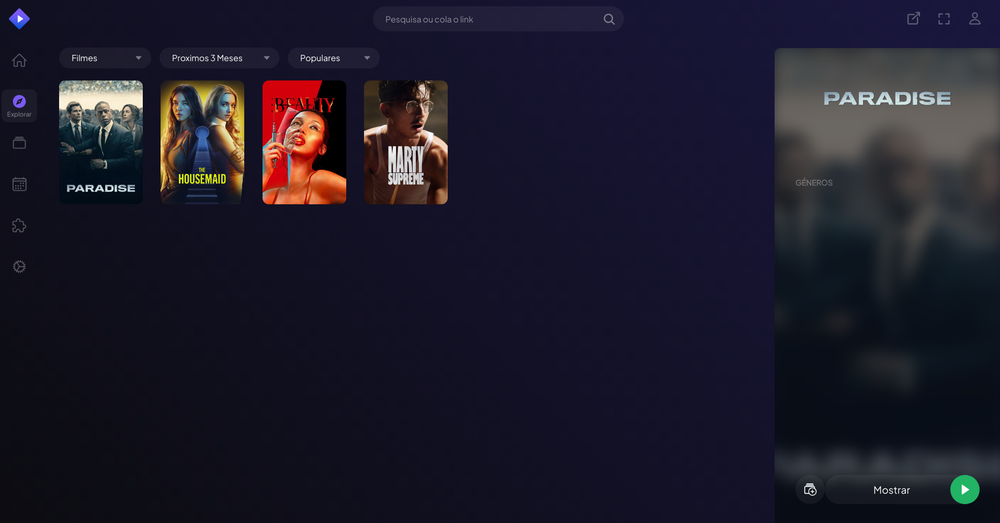
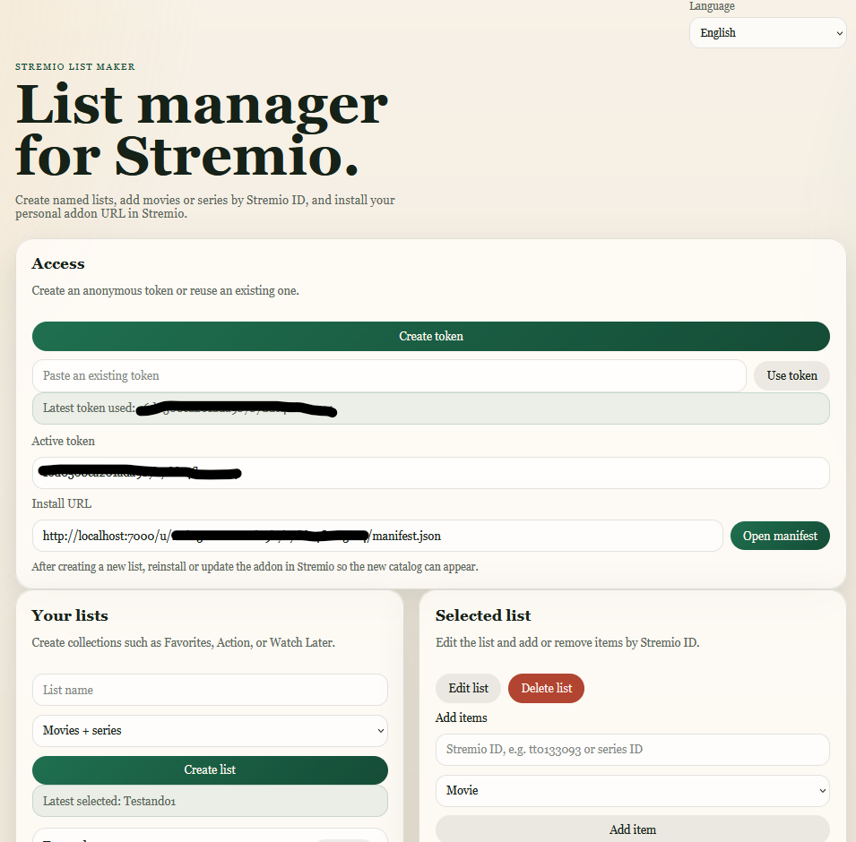

# stremio-custom-lists

Custom Stremio catalogs backed by user-managed custom lists.
Lists remains in `Explore` tab.
Catalog items reuse Cinemeta metadata so posters and other preview fields can show inside Stremio.

## Run

Inside the project folder run:
```bash
npm install
npm run dev
```

The server listens on `0.0.0.0:7000` by default, so other devices on the same network can reach it with `http://<your-lan-ip>:7000`.
On the same machine you can still use `http://localhost:7000`.

## Environment

- `PORT`: HTTP port, default `7000`
- `HOST`: Bind address, default `0.0.0.0`
- `DB_PATH`: SQLite file path, default `data.sqlite`

You can also override the bind address from the CLI:

```bash
npm run dev -- --host
npm run dev -- --host=192.168.1.50
npm run dev -- --port=8000
```

## Flow

1. Open `http://localhost:7000`
2. Click `Create a token` or paste an existing token
3. Create lists and add items by Stremio ID
4. Copy the generated addon manifest link
5. Paste it inside Stremio addon tab

## Windows scripts

- `scripts\windows\install.bat`
  Installs npm dependencies and runs the test suite.
- `scripts\windows\open-stremio-with-server.bat`
  Starts the local addon server and then opens Stremio. This works as a launcher wrapper for Windows users.

If Stremio is not installed in a default location, run the PowerShell variant directly:

```powershell
powershell -ExecutionPolicy Bypass -File .\scripts\windows\open-stremio-with-server.ps1 -StremioPath "C:\path\to\stremio.exe"
```
## Screenshots 

Explore -> Movies -> `List name` (Proximos 3 Meses):

[]

Local server GUI:

[]

## API

- `POST /api/login`
- `GET /api/me`
- `GET /api/lists`
- `POST /api/lists`
- `PATCH /api/lists/:id`
- `DELETE /api/lists/:id`
- `GET /api/lists/:id/items`
- `POST /api/lists/:id/items`
- `DELETE /api/lists/:id/items/:stremioId`

Stremio endpoints `/u/:token/...`.
